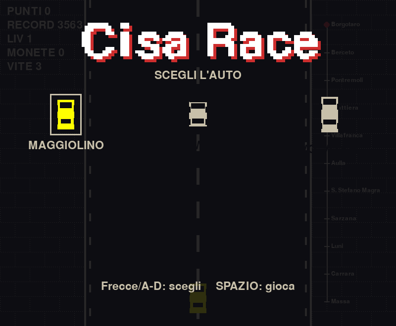

# Cisa Race

Un gioco di corsa retro 1-bit in Pygame, nato come partita personalizzata su
["Postazione Fiera"](https://github.com/sedici16/kiosk) — un chiosco da fiera
dove i visitatori modificano un videogioco a parole con l'IA.



Guida lungo l'Appennino da Borgotaro a Massa, schiva il traffico, raccogli
monete e scudi, fai fuori le auto blindate con la mitragliatrice a doppio
sparo, e attento ai cantieri stradali e alla moto contromano.

## Come si gioca

```sh
pip install pygame
python race.py
```

Python 3.10+. Serve un display.

### Comandi

- Sinistra / Destra: frecce o A / D
- Accelera: W o freccia su (tenuto premuto — lascia una scia di fumo)
- Pausa: barra spaziatrice
- Ricomincia (dopo game over): SPAZIO o R
- Esci: ESC o Q

Se è collegato un joystick/arcade stick, le istruzioni a schermo si adattano
automaticamente.

---
🤖 Generated with [Claude Code](https://claude.com/claude-code)
